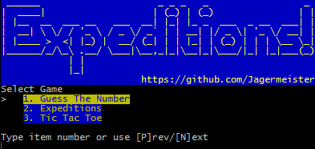
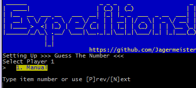
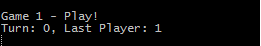

# Creating a new Game

We will walk through the steps required to create a "Guess The Number" game. This is a single player game where the goal is to guess the hidden number knowing only the upper and lower bounds. After each turn the player will know if they guessed too low, too high, or right on!

## Adding to the list of available games

### Creating a game
There are very few required attributes to fill out before seeing some progress. Let us create a new folder under `model/game/` with our game name **guessnumber**.

Adding a **GuessGame** python file will allow us to fill out some basic properties:
```python
from ..game import Game

class GuessGame(Game):
    name = 'Guess The Number'
    player_count = 1
```

Next we need to update `model/gamemanager.py` which holds all the available games and their associated agents (players). We can reuse an existing ManualAgent which is used for manual entry (aka human keyboard entry).

`model/gamemanager.py`
```python

from model.game.agent.manualagent import ManualAgent
...
from model.game.guessnumber.GuessGame import GuessGame

class GamesManager(object):

    ...

    def game_add(self):
        ...

        self._game_add_with_players(
            GuessGame,
            [ManualAgent]
        )
```

This should have created a new game and allowed it to be displayed as an option:






Not the greatest game - but we have been able to plug into the existing framework to run!

## Building out game logic
The point of this repository isn't to focus on game play logic so we will spend time describing which functions need to be created and how that interacts with the greater framework. To review the completed class, find it within `model/game/guessnumber`.

### Constructor and resetting game state

