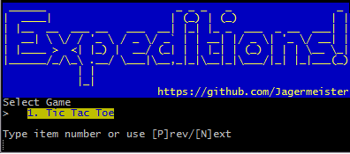
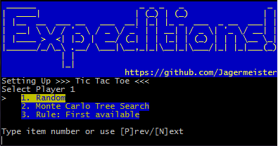
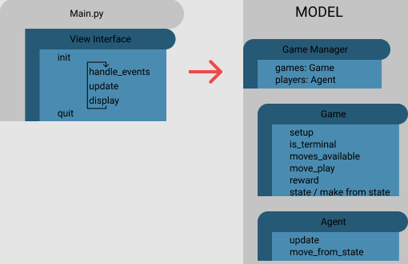
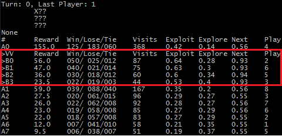

# Game, Search, Learn

Framework for running simulations on different games with different player strategies. Inspiration for this project was to utilize and understand the [Monte Carlo tree search](https://en.wikipedia.org/wiki/Monte_Carlo_tree_search).

## Installation
`pip install -r requirements.txt`

## Execution
`python src/main.py`

Selecting Game:
>

Selecting Players
>

## Framework
We have Game and Agent (player) interfaces which establish the contract between the turn playing framework and the concrete implementations.

>

## Case Study: Tic Tac Toe
>"255,168 unique games of Tic Tac Toe to be played. Of these, 131,184 are won by the first player, 77,904 are won by the second player, and 46,080 are drawn." [Jesper Juul](https://www.jesperjuul.net/ludologist/2003/12/28/255168-ways-of-playing-tic-tac-toe/)

The limited breadth (number of options per turn) and depth (number of turns in a game) of Tic Tac Toe allows for us to more easily debug MCTS as we keep the game state in mind. Within class `MCTSAgent` you can set `is_debug` to true allowing you to see how the search is ranking and selecting children:
>

First column represents the depth and order of children by visits. **A**# are top level children, while **B**# are the top responses the opponent may make to *A0*. *Reward* represent the total score for the node. For most games this is 1 point per win and 0.5 for each tie. You can find the breakdown of *Win/Lose/Tie*.

*Exploit* represents the strength of the move via *reward / visits*. *Explore* encourages less visited nodes to be seen again. This value is a function of the node's visits and the total visits of all children. [Exploration and exploitation](https://en.wikipedia.org/wiki/Monte_Carlo_tree_search#Exploration_and_exploitation)

*Next* is *Exploit + Explore* where the highest value will be the next node to be have a visit.

### Monte Carlo Tree Search Simuations
Controlling how many simulations run per move impacts the strength of the search.

<table>
    <tr>
        <th rowspan=2>Simulations</th>
        <th colspan=3>MCTS vs Random</th>
        <th>&nbsp;</th>
        <th colspan=3>Random vs MCTS</th>
        <th>&nbsp;</th>
        <th colspan=3>MCTS vs MCTS</th>
    </tr>
    <tr>
        <th>Won</th><th>Lost</th><th>Tied</th>
        <th>&nbsp;</th>
        <th>Won</th><th>Lost</th><th>Tied</th>
        <th>&nbsp;</th>
        <th>Won</th><th>Lost</th><th>Tied</th>
    </tr>
    <tr>
        <td>025</td>
        <td class="q1">458</td><td>012</td><td>030</td><td>|</td>
        <td class="q2">357</td><td>088</td><td>055</td><td>|</td>
        <td class="q2">303</td><td>122</td><td>075</td>
    </tr>
    <tr>
        <td>050</td>
        <td class="q1">486</td><td>002</td><td>012</td><td>|</td>
        <td class="q1">407</td><td>046</td><td>047</td><td>|</td>
        <td class="q2">315</td><td>062</td><td>123</td>
    </tr>
    <tr>
        <td>100</td>
        <td class="q1">493</td><td class="b">000</td><td>007</td><td>|</td>
        <td class="q1">441</td><td>031</td><td>028</td><td>|</td>
        <td class="q3">216</td><td>009</td><td>275</td>
    </tr>
    <tr>
        <td>250</td>
        <td class="q1">490</td><td class="b">000</td><td>010</td><td>|</td>
        <td class="q1">439</td><td>011</td><td>050</td><td>|</td>
        <td class="q4">093</td><td>001</td><td>406</td>
    </tr>
    <tr>
        <td>500</td>
        <td class="q1">495</td><td class="b">000</td><td>005</td><td>|</td>
        <td class="q1">458</td><td>001</td><td>041</td><td>|</td>
        <td>041</td><td class="b">000</td><td>459</td>
    </tr>
    <tr>
        <td>750</td>
        <td class="q1">497</td><td class="b">000</td><td>003</td><td>|</td>
        <td class="q1">463</td><td class="b">000</td><td>037</td><td>|</td>
        <td>006</td><td class="b">000</td><td>494</td>
    </tr>
</table>
